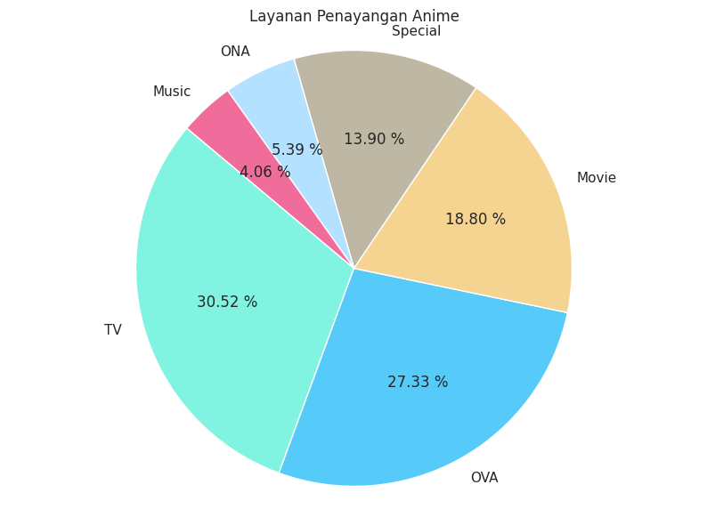
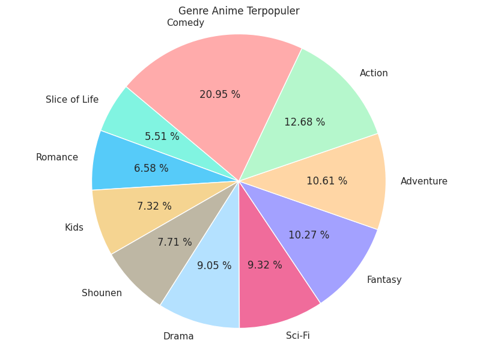
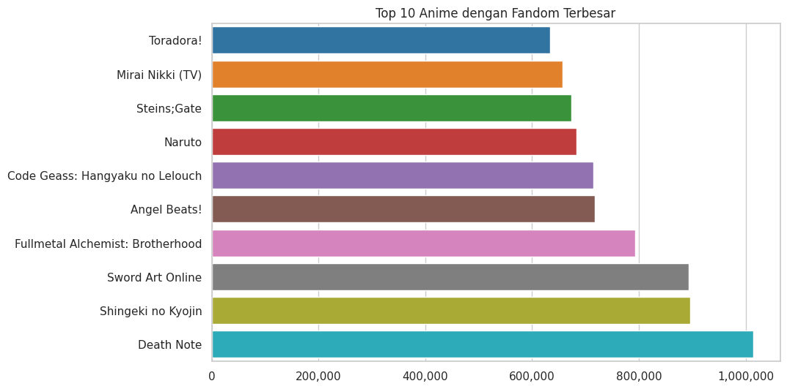
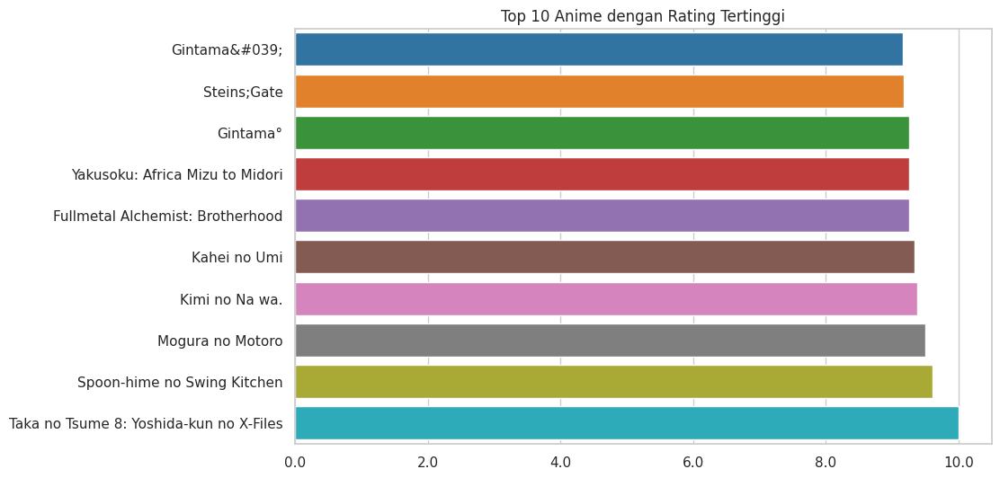

# Laporan Proyek Machine Learning - Muhammad Azhar Fikri
Proyek Akhir dari kelas Machine Learning Terapan.

## Project Overview


Anime adalah bentuk hiburan asal Jepang yang telah mendunia, mencakup berbagai genre seperti aksi, drama, fantasi, dan romansa. Dengan ribuan judul yang tersedia, pengguna sering kali kesulitan memilih anime yang sesuai dengan preferensi mereka. Oleh karena itu, sistem rekomendasi menjadi alat penting untuk membantu pengguna menemukan anime yang relevan dengan minat mereka.

Sistem rekomendasi anime diperlukan untuk membantu pengguna memilih anime yang sesuai dengan preferensi mereka, mengingat banyaknya pilihan anime yang tersedia dengan berbagai genre dan tema. Tanpa bantuan sistem rekomendasi, pengguna akan kesulitan menemukan anime yang cocok dengan minat pribadi mereka, yang bisa berujung pada pengalaman menonton yang kurang menyenangkan. Selain itu, seiring dengan pertumbuhan platform streaming yang menyediakan ribuan anime, pencarian manual tanpa sistem yang terorganisir akan semakin menjadi tantangan besar bagi pengguna baru dan lama.

Sistem rekomendasi anime dibangun dengan dua pendekatan utama:

- **Content-Based Filtering**: Menggunakan fitur-fitur dari anime itu sendiri, seperti genre, studio, atau sinopsis, untuk memberikan rekomendasi. Pendekatan ini berfokus pada kesamaan karakteristik anime yang sudah diketahui oleh pengguna sebelumnya.[[1](https://medium.com/web-mining-is688-spring-2021/content-based-anime-recommendation-4d74038fab67)]

- **Collaborative Filtering**: Mengandalkan data interaksi pengguna sebelumnya untuk merekomendasikan anime berdasarkan kesamaan preferensi antar pengguna. Pendekatan ini memanfaatkan informasi tentang perilaku pengguna yang mirip, seperti anime yang sering ditonton bersama atau dinilai tinggi oleh pengguna lain yang memiliki preferensi serupa.[[2](https://www.ewadirect.com/proceedings/tns/article/view/16509)]

Berdasarkan penelitian yang ada, penggunaan metode **Content-Based Filtering** memungkinkan rekomendasi yang lebih terarah berdasarkan kesamaan konten, meskipun pendekatan ini mungkin tidak sepenuhnya menangkap preferensi dinamis pengguna. Di sisi lain, **Collaborative Filtering** telah terbukti efektif dalam memberikan rekomendasi yang relevan, meskipun ada tantangan seperti masalah **cold-start** pada pengguna baru. Dengan latar belakang tersebut, proyek ini bertujuan untuk membangun sistem rekomendasi anime yang efektif dan efisien, yang dapat membantu pengguna menemukan anime yang sesuai dengan preferensi mereka.

## Business Understanding
Sistem rekomendasi anime bertujuan untuk mempermudah pengguna dalam menemukan anime yang sesuai dengan preferensi mereka, dengan memanfaatkan data dari berbagai fitur anime maupun interaksi pengguna. Dengan banyaknya anime yang tersedia, pengguna memerlukan sistem yang efisien untuk memilah dan merekomendasikan anime yang paling relevan.[[3](https://www.researchgate.net/publication/377022593_Analyzing_the_Effectiveness_of_Collaborative_Filtering_and_Content-Based_Filtering_Methods_in_Anime_Recommendation_Systems)]

### Problem Statements

Menjelaskan pernyataan masalah:
- Bagaimana cara merancang sistem rekomendasi yang mampu menyarankan anime kepada pengguna berdasarkan kemiripan genre dari anime yang pernah mereka sukai?
- Bagaimana memanfaatkan data interaksi pengguna, seperti rating untuk memberikan rekomendasi anime yang belum pernah ditonton oleh pengguna tersebut?
- Bagaimana membangun dan menerapkan algoritma sistem rekomendasi seperti Cosine Similarity dan K-Nearest Neighbors untuk menghasilkan rekomendasi yang relevan dan personal?
- Bagaimana melakukan evaluasi terhadap performa model sistem rekomendasi yang dibangun agar dapat diketahui tingkat akurasi dan efektivitasnya?

### Goals

Menjelaskan tujuan proyek yang menjawab pernyataan masalah:
- **Mengembangkan sistem rekomendasi berbasis konten** yang mampu mengukur kemiripan antar anime berdasarkan genre, sehingga pengguna dapat memperoleh saran anime yang sejenis dengan preferensi sebelumnya.

- **Menerapkan pendekatan collaborative filtering** yang memanfaatkan rating pengguna lain untuk menyarankan anime baru kepada pengguna yang memiliki selera serupa.

- **Mengimplementasikan model rekomendasi dengan algoritma Cosine Similarity dan K-Nearest Neighbors (KNN)** untuk menghasilkan rekomendasi yang akurat dan dapat diandalkan.

- **Melakukan evaluasi performa sistem rekomendasi** menggunakan metrik evaluasi clustering seperti **Davies-Bouldin** dan **Calinski-Harabasz** untuk mengukur kualitas pemisahan dan kerapatan antar cluster hasil sistem rekomendasi. Semakin rendah skor Davies-Bouldin dan semakin tinggi skor Calinski-Harabasz, maka semakin baik performa model dalam mengelompokkan data yang serupa.

### Solution Statements

Untuk mencapai tujuan di atas, digunakan beberapa pendekatan berikut:
- **Content-Based Filtering dengan Cosine Similarity**:  
  Menggunakan representasi teks seperti genre yang dikonversi ke dalam bentuk vektor (TF-IDF), kemudian dihitung tingkat kemiripannya dengan cosine similarity.

- **Collaborative Filtering dengan K-Nearest Neighbors**:  
  Memanfaatkan data rating pengguna dan mengukur kemiripan antar pengguna atau antar item untuk memberikan rekomendasi berdasarkan perilaku pengguna lain yang serupa.

- **Evaluasi Model dengan Davies-Bouldin dan Calinski-Harabasz**:  
  Digunakan untuk mengukur efektivitas pengelompokan (clustering) dalam sistem rekomendasi. Davies-Bouldin menilai seberapa baik cluster dipisahkan (semakin rendah semakin baik), sedangkan Calinski-Harabasz mengukur rasio antara variasi antar cluster dan dalam cluster (semakin tinggi semakin baik).

## Data Understanding

Dataset yang digunakan dalam proyek ini diperoleh dari platform [Kaggle](https://www.kaggle.com/datasets/CooperUnion/anime-recommendations-database), yang berjudul **Anime Recommendations Database**. Dataset ini berisi informasi preferensi anime berdasarkan data 76,000 users pada [MAL](https://myanimelist.net) 8 tahun yang lalu.

Dataset terdiri dari **12.294 entri** yang mencakup berbagai atribut penting yang berhubungan dengan karakteristik dan popularitas anime. Informasi ini sangat berguna untuk membangun sistem rekomendasi berbasis konten maupun kolaboratif.

### Sumber Dataset
Kaggle: [Anime Recommendations Database](https://www.kaggle.com/datasets/CooperUnion/anime-recommendations-database)

### Variabel-variabel pada Dataset Anime

Berikut adalah deskripsi dari setiap fitur yang terdapat dalam dataset utama `anime.csv`:

- **anime_id**: ID unik untuk masing-masing anime. Digunakan sebagai identifikasi primer.
- **name**: Nama dari anime.
- **genre**: Genre atau kategori dari anime. Beberapa anime memiliki lebih dari satu genre, dipisahkan oleh koma.
- **type**: Jenis anime (misalnya: TV, Movie, OVA, Special, dll).
- **episodes**: Jumlah episode dari anime. Nilai ini dapat berupa angka atau string `'Unknown'` jika data tidak tersedia.
- **rating**: Rata-rata rating yang diberikan oleh pengguna terhadap anime tersebut (skala 1–10).
- **members**: Jumlah anggota yang telah memberikan rating atau yang menambahkan anime tersebut ke daftar tontonan mereka.

### Exploratory Data Analysis (EDA)

Beberapa langkah yang telah dilakukan untuk memahami data lebih dalam:

1. **Missing Value**  
   - Beberapa nilai yang kosong pada kolom **genre** (62 nilai kosong), **type** (25 nilai kosong), dan **rating** (230 nilai kosong).
   - Diperlukan penanganan nilai-nilai yang hilang atau tidak valid sebelum melakukan pemodelan.

2. **Layanan Penayangan Anime**  
   - Platform yang paling umum menayangkan anime adalah "TV", disusul oleh "OVA", "Movie", dan "Special".



3. **Genre Anime Terpopuler**  
   - Genre paling populer adalah "Comedy", "Action", "Advnture".
   - Mayoritas anime memiliki lebih dari satu genre, menunjukkan keragaman tema dalam satu judul.



4. **Anime dengan Fandom/Komunitas Terbesar**  
   - Anime seperti **Death Note**, **Shingeki no Kyojin**, dan **Sword Art Online** memiliki jumlah anggota komunitas terbanyak, menandakan popularitas tinggi.
   - Sebagian besar anime ini berasal dari genre action/supernatural yang memang populer di kalangan penonton.



| No. | Judul Anime                               | Jumlah Anggota |
|-----|--------------------------------------------|----------------|
| 1   | Death Note                                 | 1,013,917      |
| 2   | Shingeki no Kyojin                         | 896,229        |
| 3   | Sword Art Online                           | 893,100        |
| 4   | Fullmetal Alchemist: Brotherhood           | 793,665        |
| 5   | Angel Beats!                               | 717,796        |
| 6   | Code Geass: Hangyaku no Lelouch            | 715,151        |
| 7   | Naruto                                     | 683,297        |
| 8   | Steins Gate                                | 673,572        |
| 9   | Mirai Nikki                                | 657,190        |
| 10  | Toradora!                                  | 633,817        |

5. **Anime dengan Rating Tertinggi**  
   - Beberapa anime dengan rating tertinggi seperti **Taka no Tsume 8** dan **Spoon-hime no Swing Kitchen** memiliki episode tunggal, biasanya dalam bentuk film pendek atau special.
   - Judul terkenal seperti **Fullmetal Alchemist: Brotherhood** dan **Kimi no Na wa** juga termasuk dalam daftar teratas, menunjukkan kombinasi kualitas produksi dan cerita yang kuat.



| No. | Judul Anime                                               | Rating |
|-----|------------------------------------------------------------|--------|
| 1   | Taka no Tsume 8: Yoshida-kun no X-Files                   | 10.00  |
| 2   | Spoon-hime no Swing Kitchen                               | 9.60   |
| 3   | Mogura no Motoro                                          | 9.50   |
| 4   | Kimi no Na wa                                             | 9.37   |
| 5   | Kahei no Umi                                              | 9.33   |
| 6   | Fullmetal Alchemist: Brotherhood                          | 9.26   |
| 7   | Yakusoku: Africa Mizu to Midori                           | 9.25   |
| 8   | Gintama 0                                                 | 9.25   |
| 9   | Steins Gate                                               | 9.17   |
| 10  | Gintama 1                                                 | 9.16   |

## Data Preparation
Pada tahap ini, dilakukan berbagai langkah pembersihan dan transformasi data untuk memastikan data yang digunakan bersih, relevan, dan siap digunakan dalam proses pembangunan model rekomendasi. Proses ini dibagi menjadi dua pendekatan, yaitu Content-Based Filtering dan Collaborative Filtering.

### Menangani **missing value / null** pada `anime.csv`
Menghapus baris yang mengandung nilai kosong (null) untuk menghindari error saat analisis dan memastikan integritas data.

```python
anime = anime.dropna()
```

### Menangani **duplicate** pada `rating.csv`
Menghapus data yang duplikat agar model tidak mempelajari informasi yang redundan, yang dapat memengaruhi akurasi model.

```python
rating = rating.drop_duplicates()
```

### Membersihkan simbol menggunakan **regex** pada data (`name`)
Melakukan pembersihan terhadap karakter-karakter yang tidak diinginkan dalam kolom name, seperti simbol dan entitas HTML.

```python
def cleaning(txt):
    txt = html.unescape(txt)
    txt = re.sub(r"[^\w\s]", "", txt)
    return txt.strip()

anime['name'] = anime['name'].apply(cleaning)
```

`html.unescape(txt)`: Mengubah entitas HTML menjadi karakter aslinya.   
`re.sub(r"[^\w\s]", "", txt)`: Menghapus semua karakter non-alfanumerik kecuali spasi.   
`txt.strip()`: Menghapus spasi kosong di awal dan akhir string, memastikan tidak ada karakter whitespace yang tersisa.   

### Data Preparation (Content-Based Filtering)

1. **Ekstraksi Fitur Genre dengan TF-IDF**
Menggunakan metode **TF-IDF (Term Frequency-Inverse Document Frequency)** untuk mengonversi data teks pada kolom `genre` menjadi vektor numerik yang mencerminkan pentingnya kata dalam dokumen.

* **Membuat dan Melatih TF-IDF Vectorizer**
```python
# Membuat dan Melatih TF-IDF Vectorizer

vct = TfidfVectorizer(stop_words='english')
vct.fit(devnime['genre'])
```

`TfidfVectorizer(stop_words='english')` berfungsi untuk membuang kata-kata umum (stopwords) dalam bahasa Inggris dan membangun model TF-IDF dari kolom `genre`.

* **Melihat Daftar Fitur (Kata Unik)**
```python
# Melihat Daftar Fitur (Kata Unik)

vct.get_feature_names_out()

# Output:
array(['action', 'adventure', 'ai', 'arts', 'cars', 'comedy', 'dementia',
       'demons', 'drama', 'ecchi', 'fantasy', 'fi', 'game', 'harem',
       'hentai', 'historical', 'horror', 'josei', 'kids', 'life', 'magic',
       'martial', 'mecha', 'military', 'music', 'mystery', 'parody',
       'police', 'power', 'psychological', 'romance', 'samurai', 'school',
       'sci', 'seinen', 'shoujo', 'shounen', 'slice', 'space', 'sports',
       'super', 'supernatural', 'thriller', 'vampire', 'yaoi', 'yuri'],
      dtype=object)
```

`get_feature_names_out()` digunakan untuk menampilkan semua fitur (kata unik) yang berhasil diekstrak dari kolom `genre`. Setiap kata akan menjadi satu dimensi dalam matriks TF-IDF.

* **Mengubah Genre Menjadi Matriks TF-IDF**
```python
# Mengubah Genre Menjadi Matriks TF-IDF

vct_matrix = vct.fit_transform(devnime['genre'])
```

`fit_transform()` digunakan untuk melakukan pembelajaran (fit) sekaligus mengubah (transform) data teks menjadi bentuk vektor numerik berdasarkan bobot TF-IDF.

* **Melihat Ukuran Matriks TF-IDF**
```python
# Melihat Ukuran Matriks TF-IDF

vct_matrix.shape

# Output:
(12017, 46)
```

`vct_matrix.shape` mengembalikan tuple (jumlah_data, jumlah_fitur) yang menunjukkan ukuran matriks hasil TF-IDF. Jumlah baris sesuai jumlah anime, dan jumlah kolom sesuai banyaknya kata unik.

* **Mengubah Matriks Menjadi Format Padat (Dense)**
```python
# Mengubah Matriks Menjadi Format Padat (Dense)

vct_matrix.todense()
```

`todense()` digunakan untuk mengubah matriks TF-IDF dari bentuk sparse matrix menjadi dense matrix (matriks padat), sehingga lebih mudah untuk visualisasi atau debugging meskipun lebih berat secara memori.

* **Membuat Dataframe Matriks TF-IDF**
```python
# Membuat Dataframe Matriks TF-IDF

pd.DataFrame(
    vct_matrix.todense(),
    columns=vct.get_feature_names_out(),
    index=devnime.genre
).sample(22, axis=1).sample(10, axis=0)
```

Menampilkan 10 baris dan 22 kolom acak dari matriks TF-IDF dalam bentuk DataFrame, berguna untuk inspeksi data.

2. **Cosine Similarity**

* **Menghitung Kemiripan dengan Cosine Similarity**
```python
# Menghitung Kemiripan dengan Cosine Similarity

cs = cosine_similarity(vct_matrix)
cs
```

`cosine_similarity()` menghitung nilai kesamaan antar baris dalam matriks TF-IDF. Nilai berkisar antara 0 (tidak mirip) sampai 1 (sangat mirip).

* **Membuat Dataframe Cosine Similarity**
```python
# Membuat Dataframe Cosine Similarity

cs_df = pd.DataFrame(cs, index=devnime['name'], columns=devnime['name'])
print('Shape:', cs_df.shape)

cs_df.sample(5, axis=1).sample(5, axis=0)
```

Matriks cosine similarity dikonversi menjadi sebuah DataFrame dengan indeks dan kolom menggunakan nama anime agar lebih mudah dibaca.`sample(5, axis=1)` dan `sample(5, axis=0)` menampilkan sebagian data secara acak (5 anime) sebagai sampel dari keseluruhan kemiripan.

* **Visualisasi Matriks Cosine Similarity (Heatmap) dengan sampel acak**
```python
# Visualisasi Matriks Cosine Similarity (Heatmap) dengan sampel acak

subset = cs_df.sample(3, axis=1).sample(3, axis=0)

plt.figure(figsize=(12, 8))
sns.heatmap(subset, annot=False, cmap="coolwarm", linewidths=0.5)
plt.title("Rekomendasi Anime")
plt.xticks(rotation=90)
plt.yticks(rotation=0)
plt.tight_layout()
plt.xlabel(' ')
plt.ylabel(' ')
plt.show()
```

`subset` adalah potongan kecil dari `cs_df` yang dipilih secara acak (3 anime x 3 anime) agar memudahkan visualisasi. Visualisasi ini membantu memahami hubungan antar anime berdasarkan genre secara intuitif.

### Data Preparation (Collaborative Filtering)

1. **Menyiapkan Dataframe Nama Anime**

```python
aniname = pd.DataFrame({'Nama Anime': anime['name']})

print(aniname.head())
```

Membuat DataFrame baru yang hanya memuat nama-nama anime untuk digunakan sebagai referensi.

2. **Menjadikan Nama sebagai Index**

```python
anime.set_index('name', inplace=True)
```

Mengubah kolom `name` menjadi indeks utama DataFrame agar memudahkan proses pemetaan saat merekomendasikan anime.

3. **One-Hot Encoding pada Kolom `type`**

```python
anew = pd.get_dummies(anime_ngb[['type']])
anew = pd.concat([anime_ngb, anew], axis=1)
anew = anew.drop(columns='type')

anew.head()
```

Menggunakan `get_dummies()` untuk mengubah kategori pada kolom `type` (seperti TV, Movie, OVA, dll.) menjadi format numerik (one-hot encoding). Data hasil encoding digabung kembali ke DataFrame utama (`anime_ngb`), dan kolom `type` asli dihapus karena sudah direpresentasikan secara numerik.

4. **Penerapan K-Nearest (KNN)**

```python
knn = NearestNeighbors(metric='euclidean')
knn.fit(anew)
```

Membuat model KNN dengan metrik jarak `euclidean` untuk mengukur kedekatan antar anime. Model ini akan digunakan untuk menemukan anime yang mirip berdasarkan vektor hasil one-hot encoding.

## Modeling
Dalam proyek ini, dua algoritma utama digunakan untuk membangun sistem rekomendasi, yaitu **Cosine Similarity** untuk pendekatan *Content-Based Filtering* dan **K-Nearest Neighbors (KNN)** untuk pendekatan *Collaborative Filtering*.

### 1. Content-Based Filtering dengan Cosine Similarity

Content-Based Filtering memberikan rekomendasi berdasarkan kemiripan antara item (dalam hal ini anime) yang dihitung dari fitur-fitur kontennya, seperti genre, type, dan rating. Salah satu teknik yang umum digunakan untuk mengukur kemiripan antar item adalah **Cosine Similarity**.

**Cosine Similarity** mengukur sudut kosinus antara dua vektor dalam ruang vektor. Nilai cosine similarity berada pada rentang 0 hingga 1. Nilai 1 menunjukkan bahwa kedua vektor sangat mirip (arahnya sama), sedangkan nilai 0 menunjukkan bahwa kedua vektor benar-benar berbeda (arahnya tegak lurus).

**Rumus Cosine Similarity:**

$$
\text{Cosine Similarity} = \frac{A \cdot B}{\|A\| \times \|B\|}
$$

Keterangan:
- A dan B adalah vektor fitur dari dua anime.
- A · B adalah dot product antara dua vektor.
- ||A|| dan ||B|| adalah norma (panjang) masing-masing vektor.

Anime yang memiliki nilai cosine similarity tertinggi dengan anime yang disukai pengguna akan direkomendasikan.

#### Kelebihan:
- Tidak bergantung pada interaksi pengguna lain, sehingga dapat direkomendasikan meskipun pengguna baru.
- Dapat memberikan rekomendasi yang sangat relevan dengan preferensi pengguna.
- Mudah diimplementasikan dan diinterpretasikan.

#### Kekurangan:
- Tidak menangkap tren umum atau kolektif dari komunitas pengguna.
- Terbatas pada konten yang diketahui; sulit merekomendasikan sesuatu di luar preferensi sebelumnya.
- Membutuhkan representasi fitur konten yang baik dan konsisten.

#### Penerapan Content-Based Filtering:

**Rekomendasi untuk `Naruto`**
```python
recommend_anime('Naruto')
```

| No | Nama Anime | Genre |
|----|------------|-------|
| 1 | Naruto Shippuuden Sunny Side Battle | Action, Comedy, Martial Arts, Shounen, Super Power |
| 2 | Boruto Naruto the Movie Naruto ga Hokage ni Natta Hi | Action, Comedy, Martial Arts, Shounen, Super Power |
| 3 | Naruto Shippuuden Movie 3 Hi no Ishi wo Tsugu Mono | Action, Comedy, Martial Arts, Shounen, Super Power |
| 4 | Naruto Soyokazeden Movie Naruto to Mashin to Mittsu no Otsumami Dattebayo!! | Action, Comedy, Martial Arts, Shounen, Super Power |
| 5 | Naruto Shippuuden Movie 4 The Lost Tower | Action, Comedy, Martial Arts, Shounen, Super Power |

**Rekomendasi untuk `Bungou Stray Dogs`**
```python
recommend_anime('Bungou Stray Dogs')
```

| No | Nama Anime | Genre |
|----|------------|-------|
| 1 | Bungou Stray Dogs 2nd Season | Mystery, Seinen, Supernatural |
| 2 | Baccano Specials | Action, Comedy, Historical, Mystery, Seinen, Supernatural |
| 3 | Baccano | Action, Comedy, Historical, Mystery, Seinen, Supernatural |
| 4 | Urban Square Kouhaku no Tsuigeki | Action, Mystery, Seinen |
| 5 | Kara no Kyoukai Mirai Fukuin | Drama, Mystery, Seinen, Supernatural |

### 2. Collaborative Filtering dengan K-Nearest Neighbors (KNN)

Collaborative Filtering memberikan rekomendasi dengan memanfaatkan interaksi antar item, seperti rating yang diberikan pengguna. Pada pendekatan **Item-Based KNN**, sistem mencari anime yang serupa berdasarkan pola rating yang diberikan oleh pengguna terhadap anime tersebut, kemudian merekomendasikan anime yang memiliki kesamaan dengan yang telah disukai pengguna.

K-Nearest Neighbors (KNN) adalah algoritma non-parametrik yang sering digunakan dalam klasifikasi dan regresi. KNN digunakan untuk menemukan tetangga yang paling mirip, berdasarkan metrik kemiripan seperti cosine similarity atau jarak Euclidean. Dalam KNN, kita mempertimbangkan sejumlah tetangga terdekat untuk menentukan kelas atau label dari data yang akan diklasifikasikan.

**Rumus Euclidean Distance:**

$$
\text{Euclidean Distance} = d(x, y) = \sqrt{\sum_{i=1}^{n} (x_i - y_i)^2}
$$

Keterangan:
- $x$ dan $y$ adalah dua vektor yang dapat merepresentasikan pengguna atau item.
- $d(x, y)$ adalah jarak Euclidean antara vektor $x$ dan $y$.
- $n$ adalah jumlah dimensi (fitur) pada vektor $x$ dan $y$..

#### Kelebihan:
- Menangkap pola kolektif atau tren dalam komunitas pengguna.
- Dapat memberikan rekomendasi yang bersifat "surprising" atau tidak terduga, karena berasal dari preferensi pengguna lain.
- Tidak membutuhkan informasi konten dari item (tidak perlu metadata seperti genre).

#### Kekurangan:
- Rentan terhadap masalah cold-start (pengguna baru atau item baru tanpa cukup interaksi).
- Performa menurun pada dataset yang sangat besar tanpa teknik optimasi (misalnya matrix factorization atau model-based CF).
- Dapat menghasilkan rekomendasi yang bias jika sebagian besar pengguna memberikan rating serupa.

#### Penerapan Collaborative Filtering:

**Rekomendasi untuk `Shigatsu wa Kimi no Uso`**
```python
recommend_nimek('Shigatsu wa Kimi no Uso')
```

| No | Nama Anime                        | Similarity Score |
| -- | --------------------------------- | ---------------- |
| 1  | Shigatsu wa Kimi no Uso           | 100.0%           |
| 2  | Haikyuu Second Season             | 99.99%           |
| 3  | Mushishi Zoku Shou 2nd Season     | 99.96%           |
| 4  | Code Geass Hangyaku no Lelouch R2 | 99.94%           |
| 5  | Hajime no Ippo                    | 99.91%           |
| 6  | Code Geass Hangyaku no Lelouch    | 99.91%           |
| 7  | Cowboy Bebop                      | 99.90%           |
| 8  | One Punch Man                     | 99.90%           |
| 9  | Monogatari Series Second Season   | 99.88%           |
| 10 | Mushishi Zoku Shou                | 99.88%           |

**Rekomendasi untuk `Kimi no Na wa`**
```python
recommend_nimek('Kimi no Na wa')
```

| No | Nama Anime                                      | Similarity Score |
| -- | ----------------------------------------------- | ---------------- |
| 1  | Kimi no Na wa                                   | 100.0%           |
| 2  | Kahei no Umi                                    | 99.96%           |
| 3  | Mogura no Motoro                                | 99.87%           |
| 4  | Gintama Movie Kanketsuhen Yorozuya yo Eien Nare | 99.73%           |
| 5  | Koe no Katachi                                  | 99.68%           |
| 6  | Shenmi Shijie Lixian Ji                         | 99.63%           |
| 7  | Okaachan Gomen ne                               | 99.63%           |
| 8  | Mirai ni Mukete Bousai wo Kangaeru              | 99.63%           |
| 9  | Shaka no Shougai                                | 99.63%           |
| 10 | Sen to Chihiro no Kamikakushi                   | 99.56%           |

## Evaluation

Pada **Content-Based Filtering**, evaluasi dilakukan dengan menggunakan metrik **Precision**, **Recall**, dan **NDCG**. Metrik-metrik ini digunakan untuk menilai seberapa baik rekomendasi yang diberikan sesuai dengan preferensi pengguna, berdasarkan kesesuaian fitur konten, seperti genre. Pada **Collaborative Filtering**, evaluasi dilakukan dengan menggunakan metrik **Davies-Bouldin Index (DB)** dan **Calinski-Harabasz Index (CH)**. Kedua metrik ini digunakan untuk menilai kualitas clustering berdasarkan kesamaan preferensi antar pengguna dan item yang direkomendasikan.

### 1. Precision
Precision mengukur seberapa banyak rekomendasi yang diberikan benar-benar relevan dengan kebutuhan pengguna.

**Rumus Precision:**

$$
Precision = \frac{\text{Jumlah rekomendasi relevan}}{\text{Jumlah total rekomendasi}}
$$

**Hasil Evaluasi**:  
```python
precision = sum(predict) / len(predict)
print(f'Precision: {precision:.2f}')
```

Nilai Precision: **1.00**  
Interpretasi: Nilai menunjukkan bahwa semua rekomendasi yang diberikan oleh sistem sangat relevan dengan preferensi pengguna, setiap rekomendasi yang muncul sesuai dengan genre yang dicari.

### 2. Recall
Recall mengukur seberapa banyak item relevan yang berhasil ditemukan oleh sistem dari seluruh item relevan yang tersedia dalam dataset.

**Rumus Recall:**

$$
Recall = \frac{\text{Jumlah rekomendasi relevan}}{\text{Jumlah total item relevan dalam dataset}}
$$

**Hasil Evaluasi**:  
```python
precision = sum(predict) / len(predict)
print(f'Precision: {precision:.2f}')
```

Nilai Recall: **0.0007**  
Interpretasi: Nilai mengindikasikan bahwa sistem hanya berhasil menemukan 5 item relevan dari total 7085 item relevan yang ada dalam dataset.

### 3. NDCG (Normalized Discounted Cumulative Gain)
NDCG mengukur kualitas urutan rekomendasi yang diberikan, dengan mempertimbangkan posisi item dalam daftar rekomendasi.

**Rumus DCG:**

$$
DCG = \sum_{i=1}^{n} \frac{rel_i}{\log_2(i + 1)}
$$

**Rumus NDCG:**

$$
NDCG = \frac{DCG}{\text{Ideal DCG}}
$$

Keterangan:
- $rel_i$: relevansi item ke-$i$ dalam urutan rekomendasi.
- $i$: posisi item dalam urutan rekomendasi.
- Ideal DCG adalah DCG untuk urutan yang paling optimal.

**Hasil Evaluasi**:  
```python
def dcg(relevancies):
    return sum([rel / np.log2(idx + 2) for idx, rel in enumerate(relevancies)])

ideal = sorted(predict, reverse=True)

ndcg = dcg(predict) / dcg(ideal) if dcg(ideal) != 0 else 0
print(f'NDCG: {ndcg:.2f}')
```

Nilai NDCG: **1.00**  
Interpretasi: Nilai menunjukkan bahwa urutan rekomendasi yang diberikan oleh sistem sangat optimal, dengan item yang lebih relevan ditempatkan di posisi yang lebih tinggi dalam daftar rekomendasi.

### 4. Davies-Bouldin (DB)

Davies-Bouldin mengukur seberapa baik cluster terbentuk, dengan mempertimbangkan sebaran internal (intra-cluster) dan jarak antar cluster (inter-cluster).

**Rumus DB:**

$$
DB = \frac{1}{n} \sum_{i=1}^{n} \max_{j \neq i} \left( \frac{s_i + s_j}{d_{i,j}} \right)
$$

Keterangan:
- $s_i$: rata-rata jarak antara titik dalam cluster $i$ terhadap centroid-nya.
- $d_{i,j}$: jarak antara centroid cluster $i$ dan cluster $j$.
- Semakin rendah nilai $DB$, semakin baik kualitas clustering.

**Hasil Evaluasi**:  
```python
dbs = davies_bouldin_score(anew, aniname)
print(f"Davies-Bouldin: {dbs}")
```

Nilai Davies-Bouldin: **1.7372932679932307**  
Interpretasi: Nilai ini masih tergolong **cukup**, namun menunjukkan bahwa antar cluster belum sepenuhnya terpisah sempurna.

### 5. Calinski-Harabasz (CH)

Calinski-Harabasz mengevaluasi rasio antara dispersi antar cluster terhadap dispersi dalam cluster. Semakin tinggi nilai CH, semakin baik kualitas clustering.

**Rumus CH:**

$$
CH = \frac{Tr(B_k)}{Tr(W_k)} \cdot \frac{n - k}{k - 1}
$$

Keterangan:
- $Tr(B_k)$: total dispersi antar cluster *(between-cluster dispersion)*.
- $Tr(W_k)$: total dispersi dalam cluster *(within-cluster dispersion)*.
- $n$: jumlah total data.
- $k$: jumlah cluster.

**Hasil Evaluasi**:  
```python
ch = calinski_harabasz_score(anew, aniname)
print("Calinski-Harabasz: ", ch)
```

Nilai Calinski-Harabasz = **5.687692131433239**  
Interpretasi: Nilai ini **cukup rendah**, yang menunjukkan bahwa variansi antar cluster dan dalam cluster masih belum optimal.

### Kesimpulan

- Davies-Bouldin sebesar **1.737** menunjukkan cluster yang **cukup baik**, namun bisa ditingkatkan.
- Calinski-Harabasz sebesar **5.688** mengindikasikan bahwa struktur cluster masih belum sangat kuat.

## Referensi
[1] N. Ayundini and Adiwijaya, “Content-based anime recommendation,” Medium, 2021. [Online]. Available: https://medium.com/web-mining-is688-spring-2021/content-based-anime-recommendation-4d74038fab67

[2] D. G. Tamtomo, “Sistem rekomendasi anime menggunakan collaborative filtering dan content-based filtering,” TNS: Technology and Natural Science, vol. 2, no. 2, 2023. [Online]. Available: https://www.ewadirect.com/proceedings/tns/article/view/16509

[3] H. R. Azzahra and A. D. Ramadhani, “Analyzing the effectiveness of collaborative filtering and content-based filtering methods in anime recommendation systems,” ResearchGate, 2024. [Online]. Available: https://www.researchgate.net/publication/377022593

[4] Dicoding, “Machine Learning Terapan,” [Online]. Available: https://www.dicoding.com/academies/319-machine-learning-terapan
